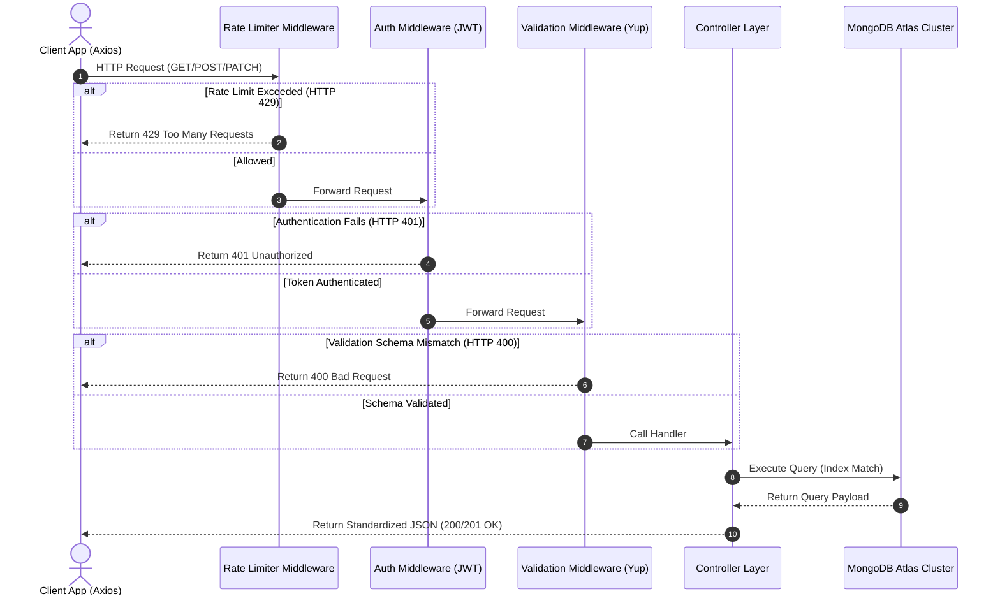

# ⚡ GitHub Dataset Explorer & Manager

An enterprise-ready, high-performance full-stack web application and REST API designed to index, query, search, and analyze over **115,011 GitHub repository records**. Features live charts, multi-dimensional filters, bulk transactions, secure token authentication, and robust rate-limiting.

---

## 🔗 Live Deployments & Documentation
* 🖥️ **Live Frontend Application**: [github-dataset-nitish-kumar.vercel.app](https://github-dataset-nitish-kumar.vercel.app/)
* 🚀 **Live Backend REST API**: [github-dataset-nitish-kumaar.onrender.com/api/v1](https://github-dataset-nitish-kumaar.onrender.com/api/v1)
* 📬 **Interactive Postman Workspace API Documentation**: [Postman Collection](https://documenter.getpostman.com/view/50841011/2sBXwtqpfD)

---

## 1. Hero Section

<div align="center">
  <h1>📊 GitHub Dataset Platform</h1>
  <p><strong>A Production-Grade Full-Stack Portal for Large-Scale Repository Analytics</strong></p>

  [](https://github-dataset-nitish-kumar.vercel.app/)
  [](https://github-dataset-nitish-kumaar.onrender.com/api/v1)
  [](https://documenter.getpostman.com/view/50841011/2sBXwtqpfD)
  [](https://opensource.org/licenses/MIT)
  <br />
  [](https://nodejs.org/)
  [](https://expressjs.com/)
  [](https://www.mongodb.com/)
  [](https://react.dev/)
  [](https://tailwindcss.com/)
  [](https://github.com/)
</div>

---

## 2. Project Overview

### 💡 What is GitHub Dataset?
GitHub Dataset is a highly optimized full-stack administrative platform created to manage and analyze extensive codebase metadata. It indexes more than **115,000 repository entries**, exposing their frameworks, languages, code elements, document classifications, and source attributes. 

### 🎯 Why It Exists
Analyzing massive datasets of repository features is historically compute-heavy and difficult to filter dynamically. Relational databases degrade under unstructured, deeply nested JSON document structures. This project serves as a reference architecture for:
1. Moving unstructured developer datasets into a highly performant, index-friendly **NoSQL Document Store**.
2. Providing a clean, interactive administrative panel that facilitates rapid search, stats auditing, bulk edits, and data visualization.

### ⚠️ The Problem It Solves
- **DDoS Vulnerability**: Protects database aggregation metrics using specialized route rate limiters.
- **Search Latency**: Speeds up database queries across 115k+ records from seconds to milliseconds using compound index configurations.
- **Data Integrity**: Deploys soft-deletion logic ensuring historical data remains intact, allowing admin-only restorations.
- **Boilerplate Reduction**: Simplifies Express handlers using reusable promise wrappers and global validation middleware.

---

## 3. Features Matrix

| Feature | Status | Description |
| :--- | :---: | :--- |
| **🛡️ Token Authentication** | ✔️ | Secure stateless JWT auth, featuring email OTP reset flows. |
| **🔄 CRUD Operations** | ✔️ | Full CRUD operations for datasets, including safe soft-deletes. |
| **📦 Bulk Operations** | ✔️ | Admin ability to batch edit, soft-delete, restore, or purge rows. |
| **📑 Pagination & Sorting** | ✔️ | High-performance cursor pagination with multi-field database sorting. |
| **🔍 Case-Insensitive Search** | ✔️ | Real-time debounced regex searching matching repositories. |
| **🗃️ Compound Filtering** | ✔️ | Multi-category filters (languages, frameworks, doc-types, sources). |
| **📈 Dynamic Visualizations** | ✔️ | Dynamic bar, donut, and distribution graphs driven by Recharts. |
| **📤 Data Import/Export** | ✔️ | Drag-and-drop JSON file loader + automated CSV export streamer. |
| **🚦 Advanced Rate Limiting** | ✔️ | Segregated limits protecting Auth, Search, File Uploads, and Queries. |
| **📱 Responsive Shell** | ✔️ | Sleek glassmorphism theme, collapsible sidebar, and full dark-mode. |

---

## 4. Tech Stack

<table width="100%">
  <tr>
    <td width="50%" valign="top">
      <h4>🎨 Frontend</h4>
      <ul>
        <li><strong>Vite 8 & React 19</strong>: Fast HMR bundling and UI render engine</li>
        <li><strong>Redux Toolkit</strong>: Global state slices (Auth, UI, Datasets, Stats)</li>
        <li><strong>Tailwind CSS v4</strong>: Modern utility styles and custom dark-theme tokens</li>
        <li><strong>Recharts</strong>: SVG-based responsive analytics charts</li>
        <li><strong>Formik & Yup</strong>: Schema-based client form validations</li>
        <li><strong>Axios</strong>: Network client with auto-attaching JWT interceptors</li>
      </ul>
    </td>
    <td width="50%" valign="top">
      <h4>🚀 Backend & Database</h4>
      <ul>
        <li><strong>Node.js & Express.js</strong>: MVC routing core and middleware pipeline</li>
        <li><strong>MongoDB Atlas</strong>: Scalable, hosted cloud NoSQL document database</li>
        <li><strong>Mongoose</strong>: Schema validation, index declaration, and querying</li>
        <li><strong>Bcrypt.js</strong>: Pre-save user password hashing hook</li>
        <li><strong>JSON Web Tokens (JWT)</strong>: Stateless authorization signatures</li>
        <li><strong>Express Rate Limit</strong>: Segregated endpoint protection</li>
      </ul>
    </td>
  </tr>
</table>

---

## 5. Architecture

The application strictly implements the industry-standard **Model-View-Controller (MVC)** design pattern, keeping logic separated from presentation:

```text
       +-------------------------------------------------------------+
       |                       React Client                          |
       +-------------------------------------------------------------+
                                      │ (Axios HTTPS request)
                                      ▼
       +-------------------------------------------------------------+
       |                        Express API                          |
       |  /api/v1/datasets                                           |
       +-------------------------------------------------------------+
                                      │
                                      ▼
       +-------------------------------------------------------------+
       |                     Route Middlewares                       |
       |  [Rate Limiter] ➔ [JWT Authorization] ➔ [Yup Validator]     |
       +-------------------------------------------------------------+
                                      │ (Valid Request Passes)
                                      ▼
       +-------------------------------------------------------------+
       |                         Controller                          |
       |  datasetController.js                                       |
       +-------------------------------------------------------------+
                                      │
                                      ▼
       +-------------------------------------------------------------+
       |                  Services & Utils Layer                     |
       |  [filterBuilder.js] ➔ [pagination.js]                       |
       +-------------------------------------------------------------+
                                      │
                                      ▼
       +-------------------------------------------------------------+
       |                      Mongoose Models                        |
       |  dataset.js (Compound Indexes Declared)                     |
       +-------------------------------------------------------------+
                                      │ (Query Execution)
                                      ▼
       +-------------------------------------------------------------+
       |                       MongoDB Atlas                         |
       |  Collection: datasets (115,011 records)                      |
       +-------------------------------------------------------------+
```

---

## 6. Folder Structure

Below is the repository directory map, indicating the separation of concerns:

```text
github_dataset_nitish_kumar/
├── backend/                        # 🚀 Backend Monolith Project Root
│   ├── src/                        # Codebase source directory
│   │   ├── config/                 # Configurations layer
│   │   │   └── db.js               # Mongoose MongoDB connection pool & listeners
│   │   ├── controllers/            # Controller layer (handles request & response wrappers)
│   │   │   ├── analyticsController.js # Aggregates languages, frameworks via MongoDB pipelines
│   │   │   ├── authController.js   # Manages registration, logins, OTP resets & profiling
│   │   │   ├── datasetController.js # Handles Paginated lists, CRUD operations, bulk actions
│   │   │   └── statsController.js  # Runs ultra-fast O(1) collection size calculations
│   │   ├── middlewares/            # Request Interceptors
│   │   │   ├── authMiddleware.js   # JWT Bearer token validator & admin route guard
│   │   │   ├── errorMiddleware.js  # Zentralized exception logger (CastErrors, duplicate indices)
│   │   │   └── rateLimiter.js      # Endpoint security controls (limit auth, search, exports)
│   │   ├── models/                 # Mongoose Database Schemas
│   │   │   ├── dataset.js          # Dataset schema containing compound indexes & soft deletes
│   │   │   └── user.js             # User schema with pre-save password-hashing hooks
│   │   ├── routes/                 # Express API Endpoint declarations
│   │   │   ├── analyticsRoutes.js  # Analytics chart aggregator paths
│   │   │   ├── authRoutes.js       # Admin authentication & profile paths
│   │   │   ├── datasetRoutes.js    # Dataset CRUD & bulk endpoints mapping
│   │   │   ├── jwtRoutes.js        # JWT token verification and refresh utilities
│   │   │   ├── searchRoutes.js     # Search endpoint paths
│   │   │   └── statsRoutes.js      # Stats metadata counts paths
│   │   ├── scripts/                # Helper scripts
│   │   │   ├── test-connection.js  # Programmatic DB connector check
│   │   │   └── test-pr14.js        # Endpoint testing suite
│   │   ├── utils/                  # Reusable utility functions
│   │   │   ├── AppError.js         # Unified operational error modeling class
│   │   │   ├── catchAsync.js       # Higher-Order wrapper removing try-catch boilerplates
│   │   │   ├── filterBuilder.js    # Regex dynamic builder mapping multiple inputs
│   │   │   └── pagination.js       # Query paginator offset mapping
│   │   └── server.js               # Express application bootsrapper & entry point
│   ├── .env                        # Local environment credentials (ignored from VCS)
│   ├── .env.example                # Sample environment template file
│   └── package.json                # Project dependencies, scripts, and details
│
├── frontend/                       # 🎨 Vite & React Client Root
│   ├── public/                     # Static media files & logo assets
│   ├── src/                        # Frontend source codebase
│   │   ├── components/             # Shared React components
│   │   │   ├── Layout.jsx          # Protected route wrapper containing Navigation & Sidebars
│   │   │   ├── Navbar.jsx          # Profile widget, dark-mode switch, and signouts
│   │   │   ├── Sidebar.jsx         # Sidebar directory navigation links
│   │   │   └── ProtectedRoute.jsx  # Auth shield protecting dashboard entries
│   │   ├── pages/                  # Page view controllers
│   │   │   ├── LandingPage.jsx     # Landing portal checking API health checks
│   │   │   ├── Login.jsx           # Formik login portal
│   │   │   ├── Register.jsx        # Account registrations
│   │   │   ├── StatsDashboard.jsx  # Dashboards displaying DB summaries
│   │   │   └── DatasetsExplorer.jsx # Main grid containing paging, search, filters & actions
│   │   ├── services/               # Communications layer
│   │   │   └── api.js              # Axios network client with authorization header attachers
│   │   ├── store/                  # Redux Toolkit Global Store
│   │   │   ├── authSlice.js        # Manages session tokens & current accounts
│   │   │   ├── datasetSlice.js     # Manages Explorer query parameters & results
│   │   │   ├── statsSlice.js       # Cache layer for dashboard summary stats
│   │   │   └── uiSlice.js          # Handles notifications overlays & dark-mode settings
│   │   ├── App.jsx                 # Routing index and route guards
│   │   ├── main.jsx                # DOM mounting entrypoint
│   │   └── index.css               # Styling rules & custom Tailwind theme definitions
│   ├── eslint.config.js            # Frontend formatting configs
│   ├── package.json                # Script runners & client modules
│   └── vite.config.js              # Vite compiler config with API proxy settings
```

---

## 7. Installation Guide

Follow these steps to run the application locally on your system:

### Prerequisites
* **Node.js** (v18.0.0 or higher)
* **npm** (v9.0.0 or higher)
* **MongoDB Atlas account** (or local MongoDB database instance)

---

### Step 1: Clone the Repository
```bash
git clone https://github.com/nitish-kumar/github_dataset_nitish_kumar.git
cd github_dataset_nitish_kumar
```

### Step 2: Configure the Backend Server
1. Navigate to the backend directory:
   ```bash
   cd backend
   ```
2. Install the node packages:
   ```bash
   npm install
   ```
3. Initialize your environment file:
   ```bash
   cp .env.example .env
   ```
4. Edit the `.env` file and insert your configuration parameters (see [Environment Variables](#8-environment-variables)).
5. Launch the backend server in development mode:
   ```bash
   npm run dev
   ```
   *The console should output: `[Server] Running in development mode on port 5000`*

---

### Step 3: Configure the Frontend Client
1. Open a new terminal window in the root directory, then navigate to the frontend directory:
   ```bash
   cd ../frontend
   ```
2. Install client dependencies:
   ```bash
   npm install
   ```
3. Initialize the environment variable:
   - Create a `.env` file in the `frontend` folder:
     ```env
     VITE_API_URL=http://localhost:5000/api/v1
     ```
4. Start the Vite hot-reloading development server:
   ```bash
   npm run dev
   ```
   *The client will start running locally at: `http://localhost:5173/`*

---

## 8. Environment Variables

### Backend Environment Variables
Create a file named [backend/.env](file:///c:/Users/LOQ/Desktop/Full%20stack%20projects/github_dataset_nitish_kumar/backend/.env) containing the following fields:

| Key Name | Type | Recommended Value / Description | Required |
| :--- | :---: | :--- | :---: |
| **`PORT`** | Number | `5000` (Local server binding port) | Yes |
| **`NODE_ENV`** | String | `development` or `production` | Yes |
| **`MONGO_URI`** | String | MongoDB connection URI string including database credentials | Yes |
| **`JWT_SECRET`** | String | Highly complex cryptographic string used to sign user tokens | Yes |
| **`JWT_EXPIRES_IN`** | String | `90d` (Duration for which JWT token remains valid) | Yes |
| **`JWT_COOKIE_EXPIRES_IN`** | Number | `90` (Duration for cookie expiration in days) | Yes |

### Frontend Environment Variables
Create a file named `frontend/.env` containing the following fields:

| Key Name | Type | Recommended Value / Description | Required |
| :--- | :---: | :--- | :---: |
| **`VITE_API_URL`** | String | `http://localhost:5000/api/v1` (URL pointing to the running backend API) | Yes |

---

## 9. API Documentation

Comprehensive and interactive API documentation including route query configurations, headers, and parameter definitions can be accessed at the live Postman workspace:

👉 **[Postman API Documentation Workspace](https://documenter.getpostman.com/view/50841011/2sBXwtqpfD)**

---

## 10. API Routes

All endpoints are versioned and prefixes map to `/api/v1`.

### 🔐 Authentication & Session Routes
| Method | Endpoint | Description | Access Level |
| :--- | :--- | :--- | :---: |
| **`POST`** | `/api/v1/auth/register` | Sign up a new user account | Public |
| **`POST`** | `/api/v1/auth/login` | Login and obtain JWT session token | Public |
| **`POST`** | `/api/v1/auth/logout` | End user session & revoke token | Private (User) |
| **`GET`** | `/api/v1/auth/profile` | Read user profile information | Private (User) |
| **`PATCH`** | `/api/v1/auth/profile` | Update profile information | Private (User) |
| **`POST`** | `/api/v1/auth/forgot-password` | Request password recovery via OTP | Public |
| **`POST`** | `/api/v1/auth/reset-password` | Reset password using verified OTP | Public |

### 🗃️ Datasets CRUD & Collection Routes
| Method | Endpoint | Description | Access Level |
| :--- | :--- | :--- | :---: |
| **`GET`** | `/api/v1/datasets` | Query all active datasets (supports filtering, search, and page paging) | Public |
| **`GET`** | `/api/v1/datasets/:id` | Read a single dataset document matching ID | Public |
| **`POST`** | `/api/v1/datasets` | Create a new dataset record | Private (User) |
| **`PUT`** | `/api/v1/datasets/:id` | Replace all fields of a dataset | Private (User) |
| **`PATCH`** | `/api/v1/datasets/:id` | Partially update attributes of a dataset | Private (User) |
| **`DELETE`** | `/api/v1/datasets/:id` | Soft-delete dataset matching ID | Private (User) |
| **`POST`** | `/api/v1/datasets/bulk-create` | Insert multiple dataset entries in one payload | Private (Admin) |
| **`PATCH`** | `/api/v1/datasets/bulk-update` | Apply changes to multiple records | Private (Admin) |
| **`DELETE`** | `/api/v1/datasets/bulk-delete` | Bulk soft-delete matching datasets | Private (Admin) |

### 📊 Aggregations & Metrics Routes
| Method | Endpoint | Description | Access Level |
| :--- | :--- | :--- | :---: |
| **`GET`** | `/api/v1/analytics/datasets/language-analysis` | Aggregate record frequencies per programming language | Public |
| **`GET`** | `/api/v1/analytics/datasets/framework-analysis` | Aggregate record frequencies per framework | Public |
| **`GET`** | `/api/v1/stats/datasets/count` | Check dataset counts (runs fast O(1) query count) | Public |

---

## 11. Sample Requests & Responses

### 1️⃣ Create Dataset (POST Request)
* **Endpoint**: `/api/v1/datasets`
* **Headers**: `Authorization: Bearer <JWT_TOKEN>`

#### Request Payload:
```json
{
  "instruction": "Explain the concept of decorators in Python.",
  "input": "def my_decorator(func): pass",
  "output": "Decorators are a tool in Python to wrap and alter functions dynamically.",
  "metadata": {
    "repo_name": "python/cpython",
    "framework": "vanilla",
    "programming_language": "python",
    "code_element": "function",
    "source_type": "github_repository",
    "doc_type": "py"
  }
}
```

#### Response Body (`201 Created`):
```json
{
  "success": true,
  "message": "Dataset record created successfully",
  "data": {
    "_id": "603d2110c410be3df0a28f41",
    "instruction": "Explain the concept of decorators in Python.",
    "input": "def my_decorator(func): pass",
    "output": "Decorators are a tool in Python to wrap and alter functions dynamically.",
    "isDeleted": false,
    "metadata": {
      "repo_name": "python/cpython",
      "framework": "vanilla",
      "programming_language": "python",
      "code_element": "function",
      "source_type": "github_repository",
      "doc_type": "py"
    },
    "createdAt": "2026-07-07T08:12:45.312Z",
    "updatedAt": "2026-07-07T08:12:45.312Z"
  }
}
```

---

### 2️⃣ Update Dataset (PATCH Request)
* **Endpoint**: `/api/v1/datasets/603d2110c410be3df0a28f41`

#### Request Payload:
```json
{
  "metadata": {
    "framework": "flask"
  }
}
```

#### Response Body (`200 OK`):
```json
{
  "success": true,
  "message": "Dataset updated successfully",
  "data": {
    "_id": "603d2110c410be3df0a28f41",
    "instruction": "Explain the concept of decorators in Python.",
    "input": "def my_decorator(func): pass",
    "output": "Decorators are a tool in Python to wrap and alter functions dynamically.",
    "isDeleted": false,
    "metadata": {
      "repo_name": "python/cpython",
      "framework": "flask",
      "programming_language": "python",
      "code_element": "function",
      "source_type": "github_repository",
      "doc_type": "py"
    },
    "createdAt": "2026-07-07T08:12:45.312Z",
    "updatedAt": "2026-07-07T08:14:10.045Z"
  }
}
```

---

### 3️⃣ Delete Response (DELETE Request)
* **Endpoint**: `/api/v1/datasets/603d2110c410be3df0a28f41`

#### Response Body (`200 OK` - Soft Delete):
```json
{
  "success": true,
  "message": "Dataset record soft-deleted successfully",
  "data": {
    "_id": "603d2110c410be3df0a28f41",
    "isDeleted": true,
    "createdAt": "2026-07-07T08:12:45.312Z",
    "updatedAt": "2026-07-07T08:15:30.112Z"
  }
}
```

---

## 12. Sample MongoDB Document

Below is a realistic document from the `githubDataSetDB.datasets` collection. Note that existing historical records lack the `isDeleted` key, necessitating dynamic query logic like `{ isDeleted: { $ne: true } }`:

```json
{
  "_id": {
    "$oid": "66487e4bc8120d3f2a58b6e2"
  },
  "instruction": "Implement a simple linear regression using PyTorch.",
  "input": "import torch\nimport torch.nn as nn\n...",
  "output": "class LinearRegression(nn.Module):\n    def __init__(self, input_dim, output_dim):\n...",
  "metadata": {
    "repo_name": "pytorch/pytorch",
    "framework": "pytorch",
    "programming_language": "python",
    "code_element": "class",
    "source_type": "github_repository",
    "doc_type": "py"
  },
  "createdAt": "2026-05-18T10:20:11.411Z",
  "updatedAt": "2026-05-18T10:20:11.411Z"
}
```

---

## 13. Error Responses

Standardized API error responses are returned as structured JSON objects:

### 🔴 400 Bad Request
Occurs when required schema validation variables are missing or incorrect:
```json
{
  "success": false,
  "statusCode": 400,
  "error": "Bad Request",
  "message": "Validation failed: instruction field is required"
}
```

### 🔴 401 Unauthorized
Returned when the JWT token is missing, expired, or signature verification fails:
```json
{
  "success": false,
  "statusCode": 401,
  "error": "Unauthorized",
  "message": "Access denied. Token has expired. Please log in again."
}
```

### 🔴 403 Forbidden
Returned when users lack sufficient administrator privileges to perform action (e.g. bulk-deleting):
```json
{
  "success": false,
  "statusCode": 403,
  "error": "Forbidden",
  "message": "You do not have administrative permissions to run this operation."
}
```

### 🔴 404 Not Found
Returned when searching for non-existent IDs:
```json
{
  "success": false,
  "statusCode": 404,
  "error": "Not Found",
  "message": "No dataset found with ID 603d2110c410be3df0a28f49"
}
```

### 🔴 409 Conflict
Returned when registering with an email address already bound to an active profile:
```json
{
  "success": false,
  "statusCode": 409,
  "error": "Conflict",
  "message": "A user with this email address already exists."
}
```

### 🔴 500 Internal Server Error
Returned when unexpected server operations or MongoDB cluster drops occur:
```json
{
  "success": false,
  "statusCode": 500,
  "error": "Internal Server Error",
  "message": "Database query timed out. Please try your request again later."
}
```

---

## 14. Screenshots Section

<details>
<summary>💻 Expand to view Application Mockup Layouts</summary>

### 🖥️ Landing & Home Page
```text
+-----------------------------------------------------------------------------------+
| 🌟 GitHub Dataset Explorer   [Home]  [Dashboard]  [API Docs]        (🌙 Dark Mode) |
+-----------------------------------------------------------------------------------+
|                                                                                   |
|        🚀 Explore and Manage Over 115,000+ GitHub Codebase Records                |
|               [ Access Dashboard ]      [ Read API Docs ]                         |
|                                                                                   |
|   📡 API System Status: [ HEALTHY ]  |  Uptime: 99.98%  |  DB Latency: 12ms        |
|                                                                                   |
+-----------------------------------------------------------------------------------+
```

### 📊 Analytics & Stats Dashboard
```text
+-----------------------------------------------------------------------------------+
| 📊 DASHBOARD  |  Total Records: 115,011  |  Users: 1,412  |  Uptime: 2.1 days     |
+-----------------------------------------------------------------------------------+
|  [ Languages Distribution ]              |  [ Top Repository Counts ]             |
|   Python     [==================] 65%    |   pytorch/pytorch      [========] 31k   |
|   Javascript [==========] 35%            |   huggingface/transf.. [======] 25k    |
|   Go         [====] 12%                  |   python/cpython       [====] 15k      |
+-----------------------------------------------------------------------------------+
```

### 🔑 Login & OTP Forgot Password
```text
+----------------------------------------+
|             SECURE LOGIN               |
+----------------------------------------+
|  Email:    [ admin@githubdataset.com ] |
|  Password: [ ***************** ]       |
|                                        |
|         [ SIGN IN ]                    |
|  [ Forgot Password? Reset via OTP ]    |
+----------------------------------------+
```

### 📱 Responsive Mobile Explorer View
```text
+----------------------------+
| 📊 GitHub Dataset    [===] |
+----------------------------+
|  Search:                   |
|  [ huggingface       ] [🔍] |
|                            |
|  +----------------------+  |
|  | transformers/trainer |  |
|  | Lang: Python  | P. 1 |  |
|  +----------------------+  |
|  | pytorch/linear_layer |  |
|  | Lang: Python  | P. 2 |  |
|  +----------------------+  |
|                            |
|   [ < Prev ]   [ Next > ]  |
+----------------------------+
```
</details>

---

## 15. Project Workflow

The flow diagram below displays the lifecycle of an API request entering the Express framework and returning database results:



---

## 16. Security Architecture

### 🔑 Stateless Session JWT Authorization
Restricts private routes utilizing the Bearer token authorization header format (`Authorization: Bearer <Token>`). Verifies cryptographic signatures, checks user records against active databases, and maps user privileges dynamically.

### 🔒 Cryptographic Password Hashing
User passwords are never stored as plain-text. They are hashed using `bcrypt` pre-save schema hooks inside the user model, utilizing a security salt factor of `12`.

### 🛡️ Segregated API Rate Limiting
To prevent brute-force attacks and resource exhaustion, different rate limits are applied:
* **Authentication Routes**: 15 requests per 15 minutes.
* **Search Engine Queries**: 20 requests per minute.
* **File Uploads / JSON Imports**: 5 requests per 15 minutes.
* **General API endpoints**: 60 requests per minute.

### 🌐 Secure CORS Configurations
Restricts API communications to verified domains, exposing response headers (like `X-Total-Count`) securely to client apps.

---

## 17. Performance & Optimization

### ⚡ MongoDB Compound Query Indexing
Ensures rapid queries across large volumes of documents by creating index matrices on high-lookup attributes:
```javascript
metadata: {
  repo_name: { type: String, index: true },
  programming_language: { type: String, index: true },
  framework: { type: String, index: true }
}
```

### 🚮 Fast Soft Delete Query Matching
Calculates data queries utilizing `{ isDeleted: { $ne: true } }` filters, taking advantage of database indexes to bypass documents marked as soft-deleted.

### 📑 Cursor Offset Pagination
Divides large collections into segments using Mongoose `.skip()` and `.limit()` parameters, keeping JSON responses compact.

### 📉 Client-Side Redux Caching
Caches stats responses on the client side using Redux Slices, saving computing power by preventing duplicate server hits.

---

## 18. Future Improvements

- [ ] **Docker Support**: Containerize application layers for unified deployment.
- [ ] **Redis Caching**: Integrate Redis caching to save database hits on popular search strings.
- [ ] **Elasticsearch Integration**: Deploy Elasticsearch for advanced typo-tolerant searches.
- [ ] **Unit testing suites**: Expand unit test coverage to >80% using Jest and Supertest.
- [ ] **GraphQL API**: Add GraphQL query capabilities to give clients full control over fields.
- [ ] **WebSockets Integration**: Implement real-time dashboard statistic syncs.

---

## 19. Contributing

We welcome contributions from open-source developers!

### Contribution Rules
1. **Fork** the repository and create your feature branch:
   ```bash
   git checkout -b feature/amazing-feature
   ```
2. **Commit** your changes with descriptive messages:
   ```bash
   git commit -m "feat: Add Redis query caching for datasets explorer"
   ```
3. **Push** to the branch:
   ```bash
   git push origin feature/amazing-feature
   ```
4. **Open a Pull Request** to the `main` branch. Ensure code meets ESLint rules and includes verification steps.

---

## 20. Running Tests

Execute backend API and verification scripts from the backend root folder:

### Run Connection Checks
```bash
cd backend
npm run test:conn
```

### Run Endpoint Integration Suites
```bash
npm run test:pr14
```

---

## 21. Deployment Guide

### 🎨 Frontend Deployment (Vercel)
1. Install Vercel CLI locally: `npm i -g vercel`
2. Run configuration commands inside the `frontend` folder:
   ```bash
   cd frontend
   vercel
   ```
3. Set the production environment variable on Vercel:
   * **`VITE_API_URL`** = `https://github-dataset-nitish-kumaar.onrender.com/api/v1`

### 🚀 Backend Deployment (Render)
1. Create a new Web Service on Render linked to your repository.
2. Configure settings inside the dashboard:
   * **Build Command**: `cd backend && npm install`
   * **Start Command**: `cd backend && node src/server.js`
3. Map environment configurations inside Render:
   * Define `MONGO_URI`, `JWT_SECRET`, `NODE_ENV=production`.

---

## 22. License

This project is licensed under the terms of the **MIT License**. See the [LICENSE](file:///c:/Users/LOQ/Desktop/Full%20stack%20projects/github_dataset_nitish_kumar/LICENSE) file for more information.

---

## 23. Author

**Nitish Kumar**

* 🐙 **GitHub**: [github.com/nitish-kumar](https://github.com/nitish-kumar) (Placeholder)
* 💼 **LinkedIn**: [linkedin.com/in/nitish-kumar](https://linkedin.com/in/nitish-kumar) (Placeholder)
* 🌐 **Portfolio**: [nitishkumar.dev](https://nitishkumar.dev) (Placeholder)

---

## 24. Support & Bug Reports

If you encounter any issues, feel free to report them:
1. Open a bug ticket in the **[GitHub Issues](https://github.com/nitish-kumar/github_dataset_nitish_kumar/issues)** page.
2. Describe your issue, outlining:
   - Request payloads triggering errors.
   - Response status codes and logs.
   - Steps to reproduce.

---

## 25. Star History

Show your support for this project by leaving a star! ⭐

<div align="center">
  <picture>
    <source media="(prefers-color-scheme: dark)" srcset="https://api.star-history.com/svg?repos=nitish-kumar/github_dataset_nitish_kumar&type=Date&theme=dark" />
    <source media="(prefers-color-scheme: light)" srcset="https://api.star-history.com/svg?repos=nitish-kumar/github_dataset_nitish_kumar&type=Date" />
    
  </picture>
</div>